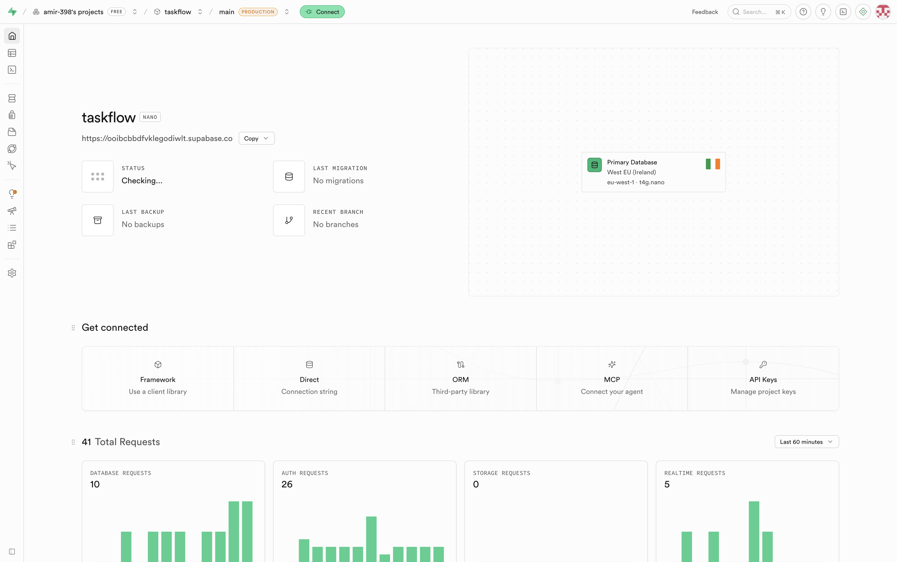
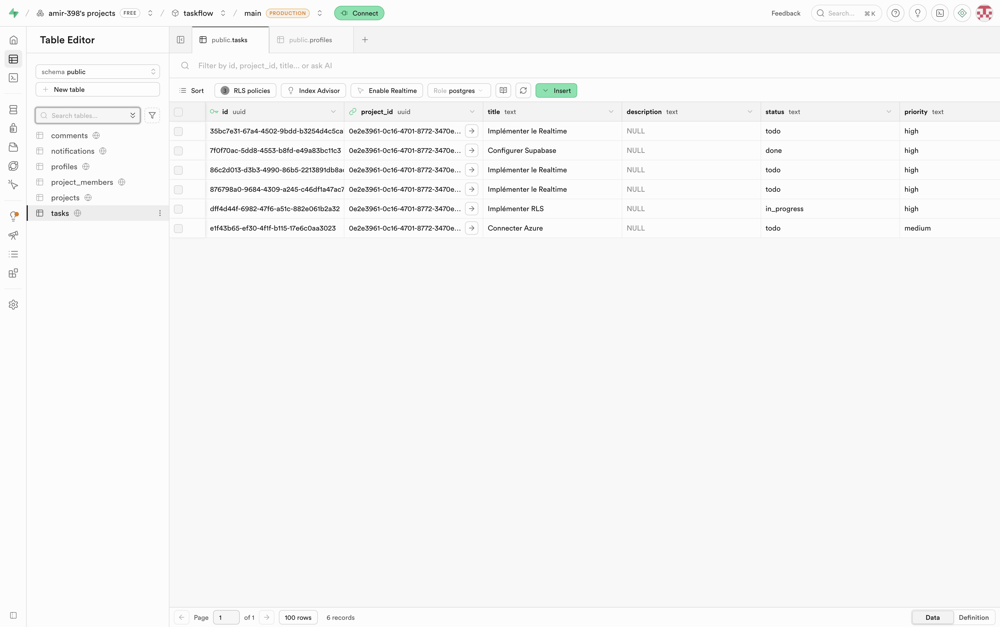
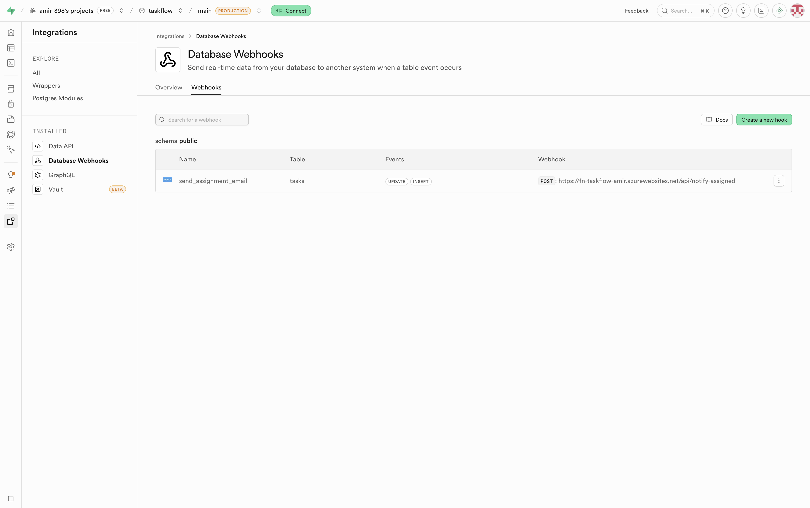
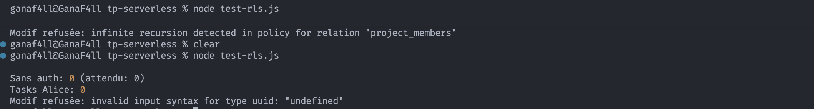
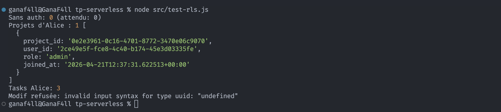
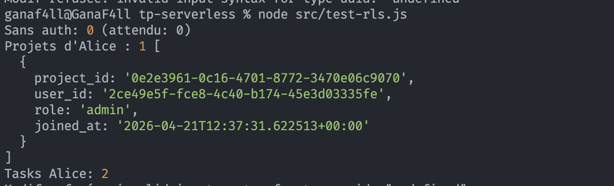
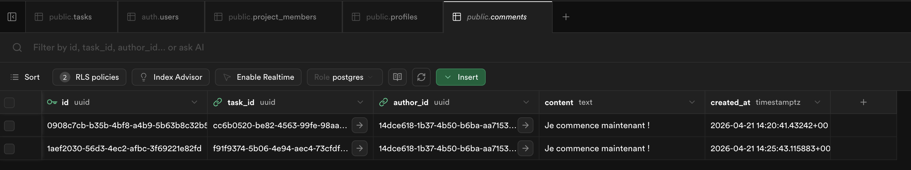
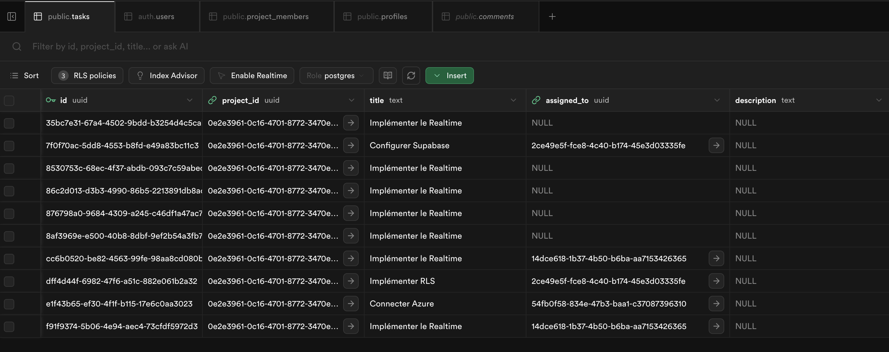
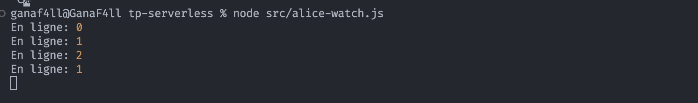

# Mise en place de Supabase

### Informations du service déployé

- **Project URL :** `https://ooibcbbdfvklegodiwlt.supabase.co`
- **API URL :** `https://ooibcbbdfvklegodiwlt.supabase.co`
- **Anon Key :** `sb_publishable_40sPgHSeXSvpKT1b-0WiLw_974PZhEl`

### Aperçu du Dashboard et des Tables

- **Dashboard Supabase :**

- **Tables :**

- **Webhooks:**


---

### Correction de l'erreur d'insertion SQL

Lors de l'insertion des données de test, la requête a échoué avec l'erreur :

> `ERROR: 42804: column "assigned_to" is of type uuid but expression is of type text`

**Cause :** PostgreSQL interprétait les IDs comme du texte simple au lieu du type UUID lors de l'utilisation de `UNION ALL`.

**Solution :** J'ai dû ajouter un cast explicite `::uuid` à chaque identifiant pour forcer le bon type de données et permettre l'insertion.
_Exemple :_ `'2ce49e5f...'::uuid`

# 2.3 Row Level Security

La policy "members_read" sur la table "project_members" causait une boucle infinie. 
Postgres doit appliquer les règles RLS au SELECT sur project_members. Donc pour vérifier si l'utilisateur a le droit de lire, ça fait un SELECT qui déclenche à nouveau la règle de sécurité, qui refait un SELECT, qui déclenche la règle, etc.
Je l'ai remplacé par une policy qui permet à l'utilisateur de lire les membres d'un projet s'il est membre de ce projet.

```sql
DROP POLICY "members_read" ON project_members;

CREATE POLICY "members_read" ON project_members FOR SELECT
  USING (user_id = auth.uid());
```
Après ça, le test-rls passait. Mais Alice n'avait accès à aucune task



Cela était dû au fait qu'alice n'était pas membre dans le projet, après l'avoir ajouter au projet avec:

```sql
insert into public.project_members (project_id, user_id, role) 
values (
  (select id from public.projects where name = 'Refonte API'), 
  '14dce618-1b37-4b50-b6ba-aa7153426365'::uuid, 
  'admin'
);
````

Elle avait accès à 3 tasks, incluant celle de Bob 


après avoir ajouter 
```sql AND (assigned_to = auth.uid())) ````

à 
```sql
alter policy "tasks_read"

on "public"."tasks"

to public

using ( ((project_id IN ( SELECT project_members.project_id
   FROM project_members
  WHERE (project_members.user_id = auth.uid()))) AND (assigned_to = auth.uid()))
);
```

Alice n'avait accès qu'à ses tasks.



# 3. Implémentation du temps réel (Realtime)

Pour permettre la collaboration en temps réel sur la gestion des tâches, nous avons mis en place des abonnements via Supabase Realtime (`supabase.channel`).

### Mise en place des écouteurs (`src/realtime.js`)
Nous avons créé un module `realtime.js` exportant la fonction `subscribeToProject`. Cette fonction configure un canal Supabase propre à un projet donné et écoute :
- Les changements sur la table `tasks` (INSERT, UPDATE, DELETE) liés au projet.
- Les ajouts sur la table `comments` (INSERT).
- La présence des utilisateurs connectés sur ce canal (Sync).

### Écoute des événements - Alice (`src/alice-watch.js`)
Ce script simule un utilisateur (Alice) qui se connecte, s'abonne au projet via `subscribeToProject`, et affiche en temps réel :
- L'ajout d'une nouvelle tâche.
- Les changements de statut des tâches.
- L'ajout de commentaires.
- Le nombre d'utilisateurs connectés simultanément.

### Exécution d'actions - Bob (`src/bob-actions.js`)
En parallèle, le script `bob-actions.js` a été créé pour simuler un collaborateur effectuant une série d'actions :
1. Création d'une tâche (auto-assignée pour respecter nos règles RLS).
2. Modification du statut de la tâche après un certain délai.
3. Ajout d'un commentaire sur la tâche.

Ainsi, si Alice écoute le canal pendant que Bob exécute ses actions, elle visualisera instantanément les événements reçus depuis la base de données.








